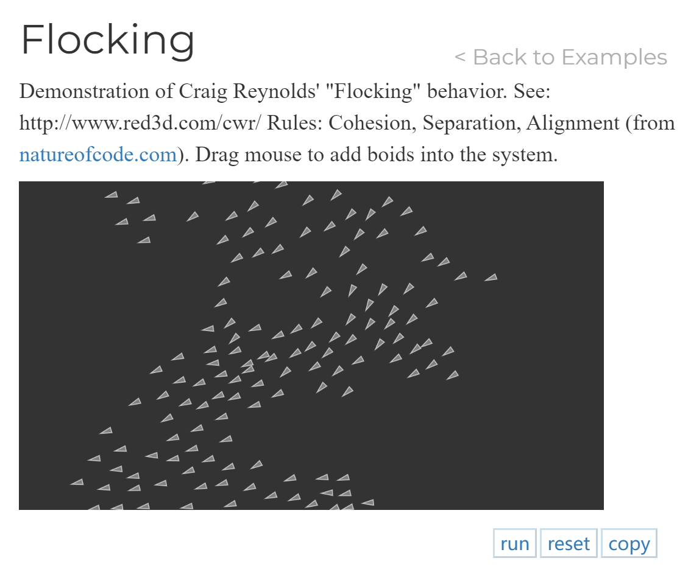

# yxie7183_quiz_8
My week 8 quiz

## Part 1: Imaging Technique Inspiration
### *Particle Systems*
For my project, I am inspired by the stars and galaxies (usd as particles) in space-themed artworks. 

I believe this imaging technique and use of particles can transcend the space theme and become a simple but effective interactive element in all kinds of artwork, fitting various themes or concepts within the project. 

This technique can create visual effects that have vast and dynamic feature. By integrating this into my project, I can offer an interactive experience where viewers can influence or navigate particle patterns, making the artwork feel alive and responsive. Also the technique can enhance visual engagement and be versatile to my other project member's designs. 

**Examples** 

*Particle effects and animation*

*Mouse move animation and interaction*

## Part 2: Coding Technique Exploration
### *Coding Technique*
I believe using p5.js works for implementing this imaging technique.

I think I can achieve it by setting the particle objects as arrays to manage their properties consistently (like initial and changing coordinates, velocity, etc.). Also, using a for loop to create them in large numbers. Use functions to animate particles response to user inputs(e.g., mouse movement). Make the particles react dynamically to enhance the interactive aspect of the design.

This technique allows particle systems in p5.js to move according to simple rules, yet simulate various natural phenomena and create visually appealing interactive graphics, making the artwork's elements fluid and keep changing based on the viewer's input and interaction.

Those interactive elements would make the artwork more engaging, and allow viewers to feel a part of the creation process, enhancing the overall experience and accessibility of the project.

**Examples** 

*Add particles and animate particles*

[Link to this example and code](https://p5js.org/examples/simulate-flocking.html)

*User interaction with particles*

[Link to this example and code](https://happycoding.io/tutorials/p5js/creating-classes/planets)